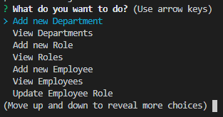
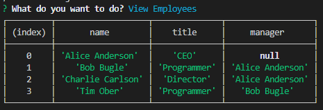

# Employee Management System

## Description 
This is homework 12, a command line employee management system with a database.

## Table of Contents 
[Installation](#installation)

[Usage](#usage)

[License](#license)

[Contributing](#contributing)

[Tests](#tests)

[Questions](#questions)
## Installation
Download the source code, then in the folder with index.js run "npm install". In MySQL Workbench run the file employees.sql to create the database. Update the user and password to the database in index.js if necessary. In MySQL Workbench run employeeSeeds.sql if you want to generate some starting data.

## Usage
In the folder with index.js run "node index.js". Answer the prompts as they appear. One limitation of the software is that it assumes department names, role titles, and last names are unique.

## License
This is licensed under the [MIT license](https://choosealicense.com/licenses/mit/).

## Contributing
Feel free to contribute

## Tests
No tests at the moment

## Questions
GitHub: https://github.com/tober65
Email: timothy.ober@gmail.com